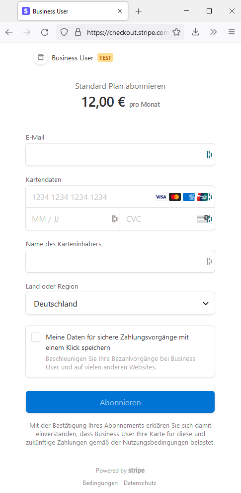
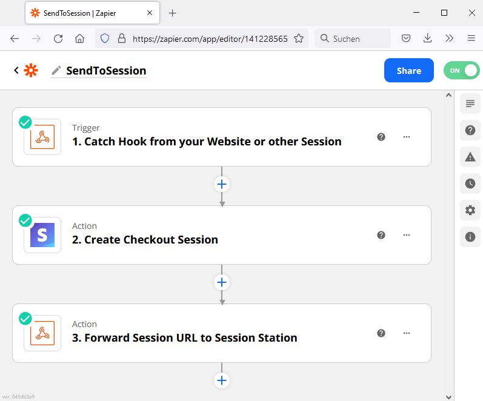
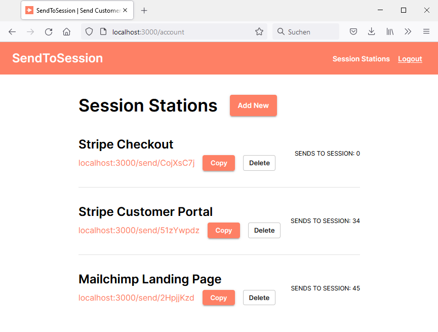

# Send-2-Session (archived)

> Archived snapshot of the May 3, 2022 deploy state. No longer maintained.

**Apps, but no website. Just URLs.**

## The pitch in one paragraph

Most SaaS products are built — UI, auth, billing, dashboards, the lot.
Send-2-Session asked: do they have to be? Stripe already has a Checkout
page. Mailchimp already has a campaign signup page. Calendly already has
a booking page. What if you could string those existing third-party pages
together by their URLs into a complete user flow — and skip building most
of the app? Send-2-Session is the orchestration layer that lets you
define a "station" for each provider, extract the next session URL from
its API response, and route the user onward — no website needed beyond a
landing page.

## How it works — the Stripe → Zapier → S2S loop

A user defines a **flow** as a sequence of **stations**. Each station
points at a third-party SaaS page (e.g. a Stripe Checkout link, a Stripe
Customer Portal session, a Mailchimp signup form). The orchestration is
invisible to the customer — they just click through what looks like a
connected sequence of pages.

A live example, end-to-end:

**1. The customer hits a Stripe Payment Link and completes payment.**

**2. Zapier catches the Stripe webhook, creates the next session
(e.g. a Customer Portal session), and pushes the resulting session URL
to the matching S2S Station.**

**3. The customer lands on a stable S2S Station URL.
S2S resolves it to the latest session URL pushed in step 2 and forwards.**

S2S sits between the workflow engine (Zapier/Make/Pipedream) and the
customer — providing a stable URL that no-code builders (Webflow, Carrd,
Squarespace, …) can embed, while the actual destination is resolved at
runtime. That's the gap workflow engines alone don't fill: they
orchestrate well in the backend, but they don't give the customer a
stable URL to be sent to when the destination URL is generated
dynamically per session.

## What's in this repo

| Folder         | What it shows                                                                 |
| ---            | ---                                                                           |
| `src/`         | React 17 frontend (Material-UI 4) — landing, auth, station builder, session routing. |
| `functions/`   | Firebase Cloud Functions — Firestore triggers and Express server for `/station/url/**` and `/station/customer/**` routes. |
| `firebase.json`| Hosting + Functions + Firestore + Auth + Emulator configuration. |
| `build/`       | Compiled production bundle from the May 3, 2022 deploy (preserved as-is). |

## Tech stack

- **Frontend**: React 17, Material-UI 4, react-router-dom 5
- **Backend**: Firebase Cloud Functions (Node.js + Express)
- **Data**: Firestore (users → stations → sessions hierarchy)
- **Auth**: Firebase Auth (email/password)
- **Hosting**: Firebase Hosting + Functions

## Status

- Active development: **December 2021 – late 2022**
- Last build & deploy: **2022-05-03** (live on Firebase Hosting)
- End-to-end loop verified through internal testing: 34 Customer-Portal
  redirects and 45 Mailchimp-Landing redirects logged through the live
  deploy
- Original Firebase project no longer maintained
- Frozen snapshot, not under active development

## Why archived

The end-to-end orchestration worked. What ended the project was
distribution — reaching no-code site owners who'd wire a fourth tool
into their stack as a solo builder. Today, AI-native tooling would cut
the build effort to a fraction; the validation discipline learned in
Digitale Leute School's PM Bootcamp would tackle distribution before
code.

## What's been redacted

For archive hygiene:

- `src/firebase.js` — Web API key + project ID replaced with placeholders
- `.firebaserc` — replaced by `.firebaserc.example`
- `firebase-emulators/` and `node_modules/` removed (regenerable)

The compiled `build/` bundle is preserved as the original deploy artifact.
Firebase Web API keys are not secrets per Firebase's design (security is
enforced via Firestore Rules); they are redacted in source for repo hygiene.

## Running locally

This is an archive — running it requires a fresh Firebase project. Steps:

1. Create a new Firebase project (Firestore + Auth + Functions)
2. Copy your config into `src/firebase.js`
3. Copy your project ID into `.firebaserc`
4. `npm install && npm install --prefix functions`
5. `npm start` for dev, `npm run build && firebase deploy` to ship

## Acknowledgements

Initial project scaffolding (React + Firebase Auth + Firestore setup) was
inspired by a YouTube tutorial for a URL-shortener (the `package.json`
name `shortly` reflects that early origin). The session-flow orchestration
logic, station/session data model, and Cloud Functions integration are
original implementation.

---

*Restored in 2026 from a local archive of the May 2022 build.*
